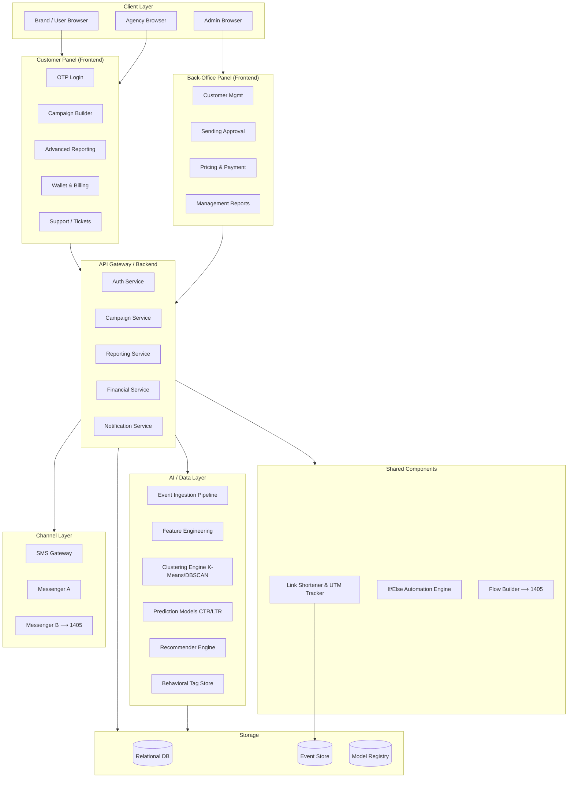
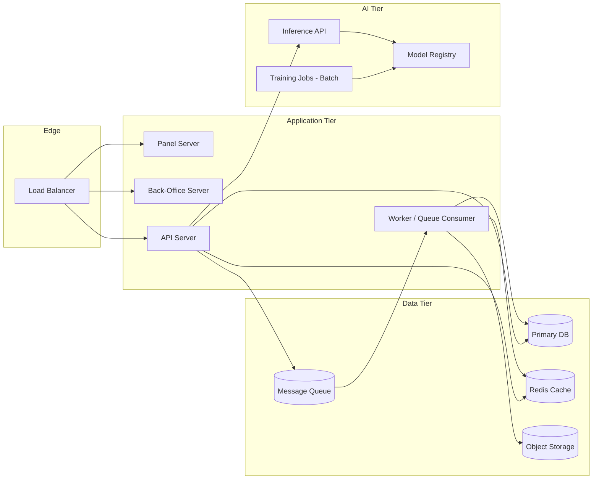
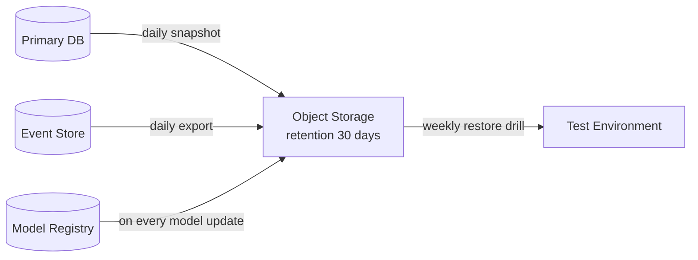
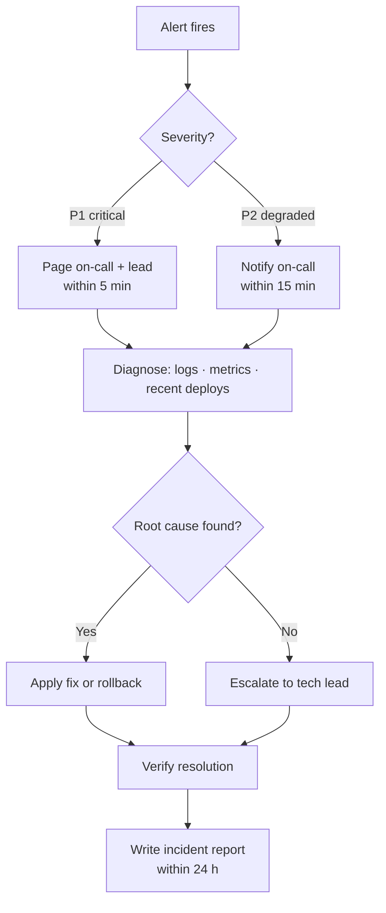

# System Architecture

## Component Overview

---

## Deployment Topology

---

## Ops Runbook — Overview

### Monitoring Checks

| Signal | Alert Threshold | Action |
|--------|----------------|--------|
| API response time | > 2 s p95 | Page on-call; check queue backlog |
| Platform availability | < 99% over 5 min | Escalate; check LB and app tier |
| Model drift detected | Any | Trigger safe model update job |
| Event pipeline lag | > 15 min | Check stream processor; restart if stalled |
| Error rate | > 1% over 10 min | Inspect logs; roll back last deploy if correlated |

### Backup Schedule

### Incident Response Steps

