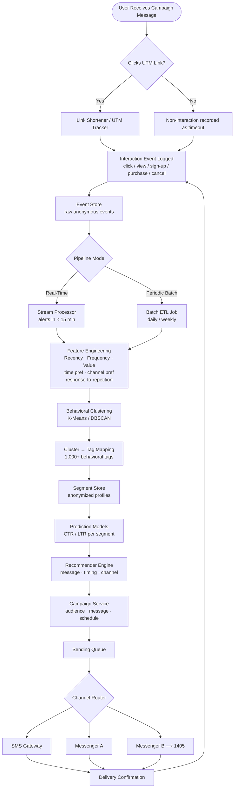

# Data Flow

## End-to-End: Event Capture → Model Output → Campaign

---

## Data Lineage Summary

| Stage | Input | Output | Quality Gate |
|-------|-------|--------|--------------|
| Event capture | User click on UTM link | Raw event record | Schema validation |
| ETL / cleaning | Raw events | Standardized events | Field coverage ≥ 90%, error ≤ 2% |
| Feature engineering | Cleaned events | Feature vectors | Completeness check |
| Clustering | Feature vectors | Cluster labels | Silhouette ≥ 0.45 |
| Tag mapping | Cluster labels | Behavioral tags | Coverage ≥ 60% |
| Prediction | Tagged profiles | CTR/LTR scores | AUC ≥ 0.75 |
| Recommendation | Scores + context | Message/time/channel | Response < 4 s (MVP) |
