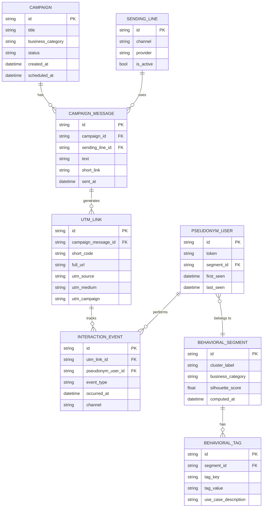

# Behavioral Event Schema — ER Diagram

---

## Event Types

| Event Type | Triggered By | Recorded Field |
|------------|-------------|----------------|
| `click` | User clicks short link | `occurred_at`, channel |
| `view` | Landing page view | `occurred_at` |
| `sign_up` | Form submission | `occurred_at` |
| `purchase` | Checkout completion | `occurred_at`, value |
| `cancel` | Subscription cancel | `occurred_at` |
| `no_interaction` | Timeout after send | inferred, `occurred_at` |
