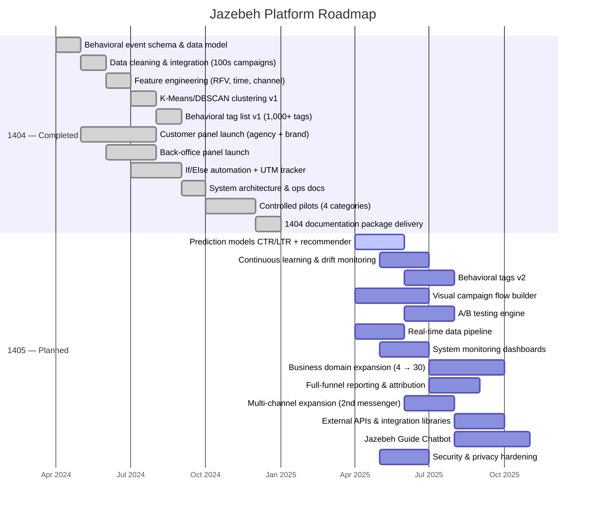

# Project Roadmap — 1404 Completed vs 1405 Planned

---

## Milestone Summary

| Milestone | Year | Status |
|-----------|------|--------|
| Behavioral event schema v1 | 1404 | Done |
| Platform pilot launch (2 panels) | 1404 | Done |
| Tag list v1 (1,000+ tags) | 1404 | Done |
| 4-category pilot case studies | 1404 | Done |
| Prediction models + recommender | 1405 | Planned |
| Visual flow builder | 1405 | Planned |
| 30-category segment expansion | 1405 | Planned |
| Jazebeh Guide Chatbot | 1405 | Planned |
