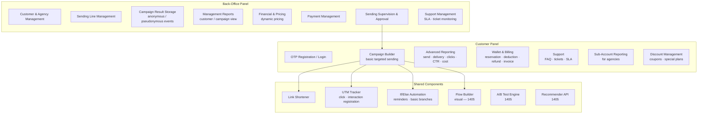
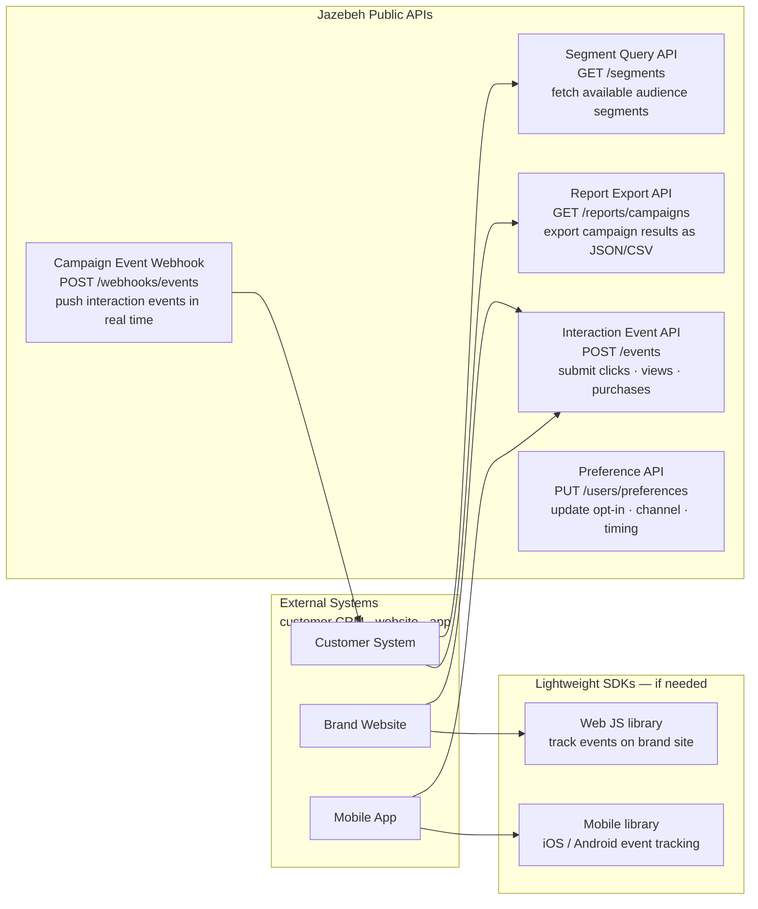

# Platform Module Map

## Module Overview

---

## Module Status Table

| Module | Panel | Status |
|--------|-------|--------|
| OTP Registration / Login | Customer | Live |
| Campaign Builder (basic) | Customer | Live |
| Advanced Reporting | Customer | Live |
| Wallet & Billing | Customer | Live |
| Support / Tickets | Customer | Live |
| Sub-Account Reporting | Customer | Live |
| Discount Management | Customer | Live |
| Customer & Agency Management | Back-Office | Live |
| Sending Line Management | Back-Office | Live |
| Campaign Result Storage | Back-Office | Live |
| Management Reports | Back-Office | Live |
| Financial & Dynamic Pricing | Back-Office | Live |
| Payment Management | Back-Office | Live |
| Sending Approval | Back-Office | Live |
| Support SLA Monitor | Back-Office | Live |
| Link Shortener & UTM Tracker | Shared | Live |
| If/Else Automation | Shared | Live |
| Visual Flow Builder | Shared | 1405 |
| A/B Test Engine | Shared | 1405 |
| Recommender API | Shared | 1405 |

---

## External API Surface (1405)

| API | Direction | Purpose |
|-----|-----------|---------|
| Campaign Event Webhook | Outbound (Jazebeh → customer) | Notify customer system when campaign events occur |
| Segment Query API | Inbound (customer → Jazebeh) | Let customer systems read available segments |
| Interaction Event API | Inbound (customer → Jazebeh) | Submit conversion events from brand's own site/app |
| Report Export API | Inbound (customer → Jazebeh) | Download campaign performance data |
| Preference API | Inbound (customer → Jazebeh) | Sync user communication preferences |
