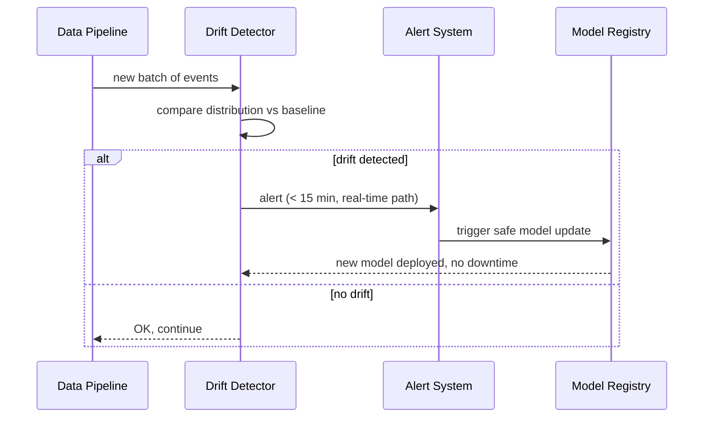

# ML / AI Pipeline — Behavioral Profiling

## Pipeline Stages

```mermaid
flowchart LR
    subgraph Ingest["1. Ingest"]
        A[UTM Click Events]
        B[View / Sign-up / Purchase]
        C[Non-interaction Timeouts]
    end

    subgraph Clean["2. Clean & Integrate"]
        D[Field Standardization]
        E[Deduplication]
        F[Quality Control\nerror ≤ 2%]
    end

    subgraph Features["3. Feature Engineering"]
        G[Recency]
        H[Frequency]
        I[Value / Monetary]
        J[Time-of-Day Preference]
        K[Channel Preference]
        L[Response to Repetition]
        M[Response to Reminders]
    end

    subgraph Cluster["4. Clustering"]
        N[K-Means]
        O[DBSCAN]
        P[Silhouette Evaluation\n≥ 0.45]
    end

    subgraph Tags["5. Tag Mapping"]
        Q[Cluster → Tag Assignment\n1,000+ tags v1]
        R[Tag Enrichment\n↑ 1405 v2]
        S[Low-impact Tag Removal\n↑ 1405]
    end

    subgraph Predict["6. Prediction — 1405"]
        T[CTR Model]
        U[LTR Model]
        V[AUC ≥ 0.75]
    end

    subgraph Recommend["7. Recommender — 1405"]
        W[Message Tone Selector]
        X[Timing Optimizer]
        Y[Channel Router]
    end

    subgraph Monitor["8. Continuous Learning — 1405"]
        Z[Drift Detector\nalert < 15 min]
        AA[Safe Model Update\nno downtime]
        AB[Cross-industry Stability Check]
    end

    Ingest --> Clean --> Features --> Cluster --> Tags --> Predict --> Recommend
    Recommend --> Monitor --> Cluster
```

---

## Model Cards Summary

| Model | Algorithm | Input Features | Key Metric | Target |
|-------|-----------|---------------|------------|--------|
| Segmentation v1 | K-Means | RFV + time + channel | Silhouette score | ≥ 0.45 |
| Segmentation v1 | DBSCAN | RFV + time + channel | Labeling coverage | ≥ 60% |
| CTR Prediction (1405) | TBD | Tags + context | AUC | ≥ 0.75 |
| LTR Prediction (1405) | TBD | Tags + context | Brier score | minimize |
| Recommender (1405) | TBD | Scores + budget | Response time (MVP) | < 4 s |
| Recommender (1405) | TBD | Scores + budget | Response time (adv.) | < 500 ms |

---

## Drift Monitoring

