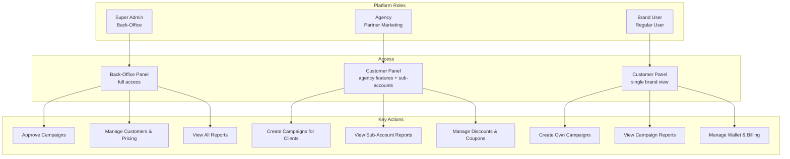
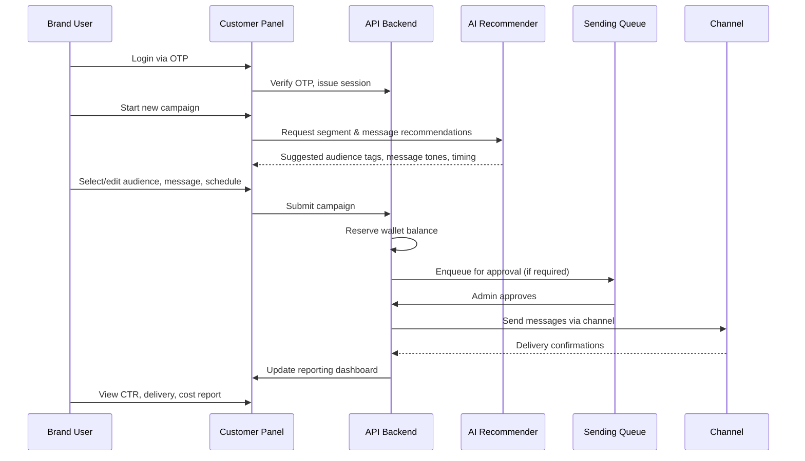
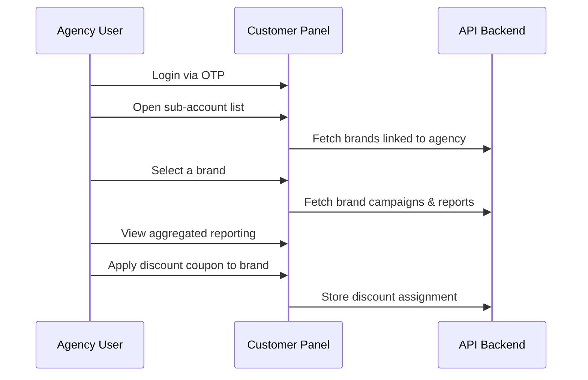

# User Roles & Journeys

## Role Map

```mermaid
graph TD
    subgraph Roles["Platform Roles"]
        A[Super Admin\nBack-Office]
        B[Agency\nPartner Marketing]
        C[Brand User\nRegular User]
    end

    subgraph Access["Access"]
        A --> D[Back-Office Panel\nfull access]
        B --> E[Customer Panel\nagency features + sub-accounts]
        C --> F[Customer Panel\nsingle brand view]
    end

    subgraph Actions["Key Actions"]
        D --> G[Approve Campaigns]
        D --> H[Manage Customers & Pricing]
        D --> I[View All Reports]
        E --> J[Create Campaigns for Clients]
        E --> K[View Sub-Account Reports]
        E --> L[Manage Discounts & Coupons]
        F --> M[Create Own Campaigns]
        F --> N[View Campaign Reports]
        F --> O[Manage Wallet & Billing]
    end
```

---

## Journey: Brand Creates a Campaign

```mermaid
sequenceDiagram
    participant U as Brand User
    participant P as Customer Panel
    participant API as API Backend
    participant AI as AI Recommender
    participant Q as Sending Queue
    participant CH as Channel

    U->>P: Login via OTP
    P->>API: Verify OTP, issue session
    U->>P: Start new campaign
    P->>AI: Request segment & message recommendations
    AI-->>P: Suggested audience tags, message tones, timing
    U->>P: Select/edit audience, message, schedule
    P->>API: Submit campaign
    API->>API: Reserve wallet balance
    API->>Q: Enqueue for approval (if required)
    Q->>API: Admin approves
    API->>CH: Send messages via channel
    CH-->>API: Delivery confirmations
    API->>P: Update reporting dashboard
    U->>P: View CTR, delivery, cost report
```

---

## Journey: Agency Manages Sub-Accounts

```mermaid
sequenceDiagram
    participant AG as Agency User
    participant P as Customer Panel
    participant API as API Backend

    AG->>P: Login via OTP
    AG->>P: Open sub-account list
    P->>API: Fetch brands linked to agency
    AG->>P: Select a brand
    P->>API: Fetch brand campaigns & reports
    AG->>P: View aggregated reporting
    AG->>P: Apply discount coupon to brand
    P->>API: Store discount assignment
```
