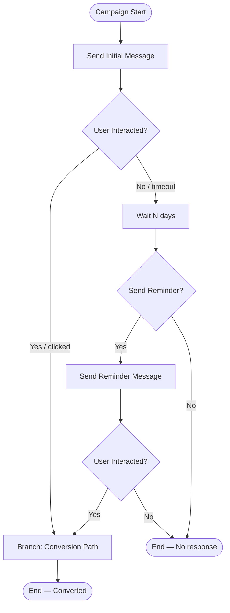
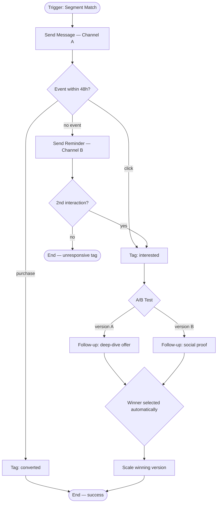
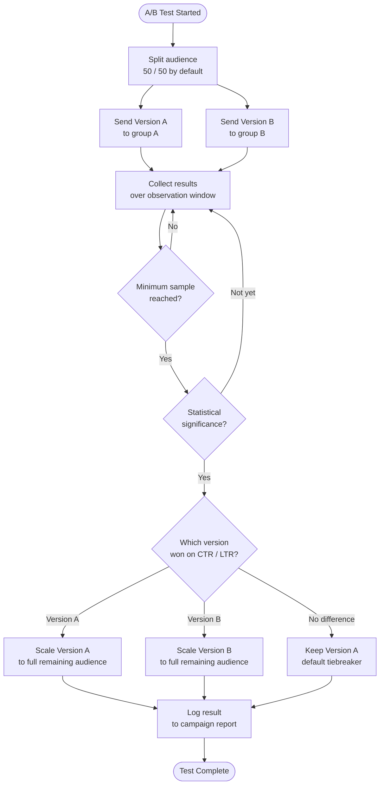

# Campaign Flow Designer

## Current Automation (If/Else — 1404)

---

## Planned Visual Flow Builder (1405)

---

## Flow Builder Constraints

| Constraint | Value |
|------------|-------|
| Max active flows | ≥ 1,000 |
| Flow change application time | < 1 second |
| Anti-collision rule | prevents overlapping campaigns on same audience |
| A/B winner selection | automatic, based on CTR/LTR results |

---

## A/B Test — Winner Selection Flow

> The platform selects the winner automatically — no manual intervention required.
