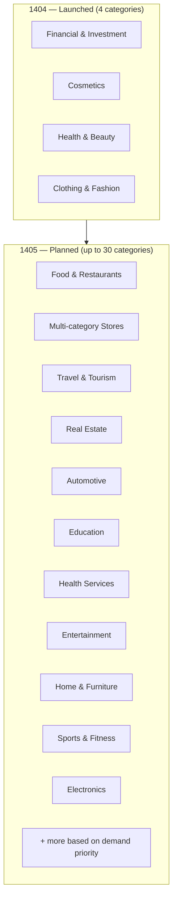

# Business Domain Expansion

## Growth Plan: 4 → 30 Market Categories

---

## Deliverable per Category

Each category produces:

| Deliverable | Description |
|-------------|-------------|
| Behavioral segment output | Anonymized cluster profiles for that industry |
| Playbook | Recommended message templates, timing, frequency, channels |
| Tag subset | Relevant behavioral tags from v1/v2 list |
| Ready-to-use guide | Quick-start guide for campaign managers |

---

## Expansion Priority Criteria

1. Volume — number of potential campaigns in the market
2. Data availability — historical campaigns already collected
3. Customer demand — requests from existing agency/brand users
4. Segment stability — cross-industry Silhouette score consistency
