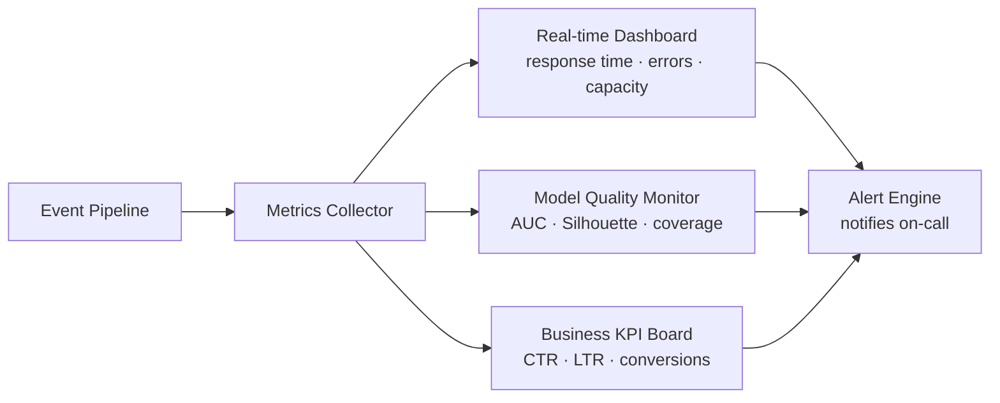

# KPI & Success Metrics

## Data Quality

| Metric | Target | Scope |
|--------|--------|-------|
| Standard field coverage on historical data | ≥ 90% | ETL / cleaning |
| Schema inconsistency error rate | ≤ 2% | ETL / cleaning |
| Behavioral tags with described use cases | ≥ 1,000 | Tag list v1 |

## Model Quality

| Metric | Target | Scope |
|--------|--------|-------|
| Clustering Silhouette score | ≥ 0.45 | Clustering v1 |
| Behavioral labeling coverage of valid data | ≥ 60% | Clustering v1 |
| CTR / LTR improvement vs baseline | ≥ 2× | Pilot evaluation |
| Prediction model AUC | ≥ 0.75 | CTR/LTR models (1405) |
| Calibration error (Brier score) | minimize | CTR/LTR models (1405) |

## Performance

| Metric | Target | Scope |
|--------|--------|-------|
| Recommendation response time (MVP) | < 4 seconds | Recommender API |
| Recommendation response time (advanced) | < 500 ms | Recommender API |
| Flow change application time | < 1 second | Flow builder |
| Max active flows | ≥ 1,000 | Flow builder |
| Channel route-switching time | < 3 seconds | Multi-channel |

## Reliability

| Metric | Target | Scope |
|--------|--------|-------|
| Platform availability in pilot | ≥ 99% | All services |
| Drift alert latency (real-time path) | < 15 minutes | Drift monitor |
| Model updates without service disruption | required | Continuous learning |

## Security & Privacy

| Metric | Target | Scope |
|--------|--------|-------|
| Data leakage incidents in pilots | 0 | Privacy |
| Audit report completeness | 100% logged | Chatbot / RBAC |
| Preference enforcement in sending path | automatic | Preference center |

## Business

| Metric | Target | Scope |
|--------|--------|-------|
| Pilot categories covered | 4 (1404) → 30 (1405) | Domain expansion |
| Controlled pilot case studies | ≥ 2 with before/after KPI | 1404 delivery |
| Internal recommendation acceptance rate | ≥ 1 per evaluation | Chatbot (1405) |

---

## Baseline vs Target Comparison

| Metric | Pre-Jazebeh Baseline | 1404 Pilot Result | 1405 Target |
|--------|---------------------|-------------------|------------|
| CTR vs generic blast | 1.0× | ≥ 2.0× ✓ | Sustained across 30 categories |
| Audience labeled / targetable | ~0% (no segmentation) | ≥ 60% ✓ | ≥ 70% with tags v2 |
| Cluster quality (Silhouette) | N/A | ≥ 0.45 ✓ | Stable across new industries |
| Prediction accuracy (AUC) | N/A | N/A — not built yet | ≥ 0.75 |
| Recommendation speed | N/A | N/A — not built yet | < 500 ms |
| Campaign creation time | Manual, hours | Same — UI only | Minutes (chatbot + templates) |
| Industries covered | 0 | 4 ✓ | 30 |
| Platform uptime | N/A | ≥ 99% ✓ | ≥ 99% |

---

## Metric Tracking Dashboard (planned for 1405)

