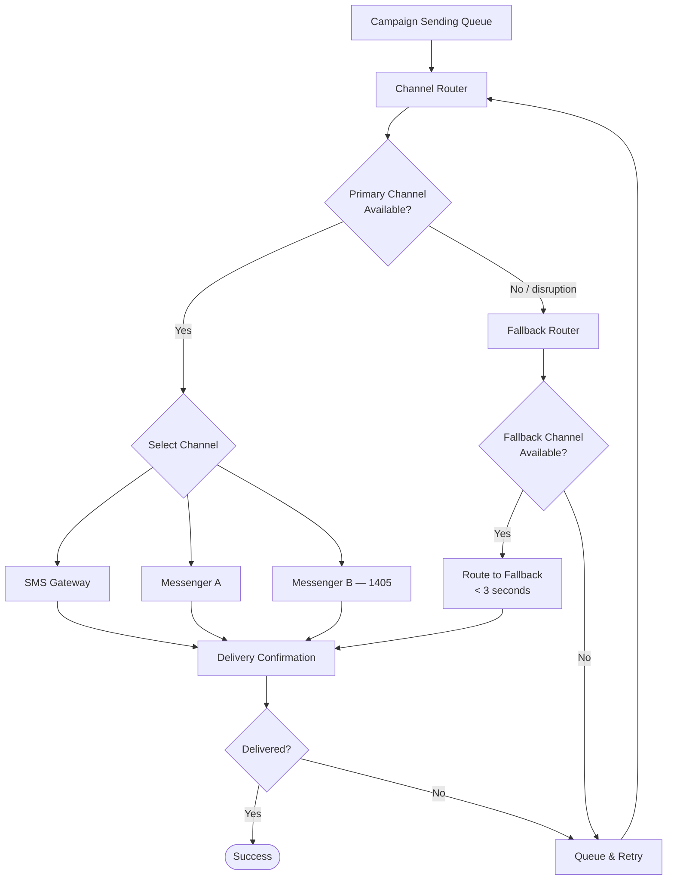
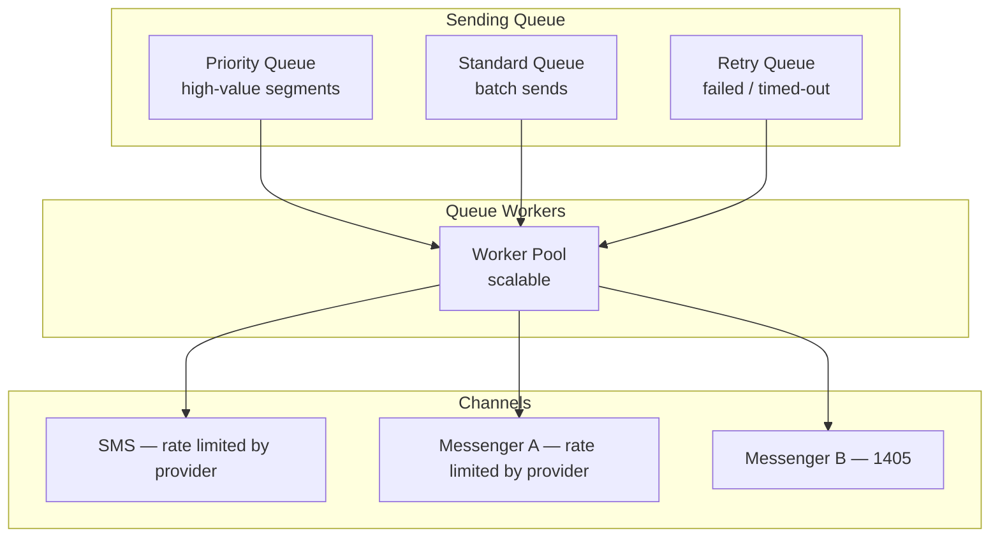

# Multi-Channel Architecture

## Channel Routing & Fallback

---

## Queue & Rate Management

---

## Channel Capabilities

| Capability | SMS | Messenger A | Messenger B (1405) |
|------------|-----|-------------|-------------------|
| Text message | Yes | Yes | Yes |
| Rich media | No | Yes | Yes |
| Read receipts | No | Yes | Yes |
| Delivery confirmation | Yes | Yes | Yes |
| Rate-limit management | Yes | Yes | Yes |
| Automatic fallback | Yes | Yes | Yes |
| Route-switch time | < 3 s | < 3 s | < 3 s |
