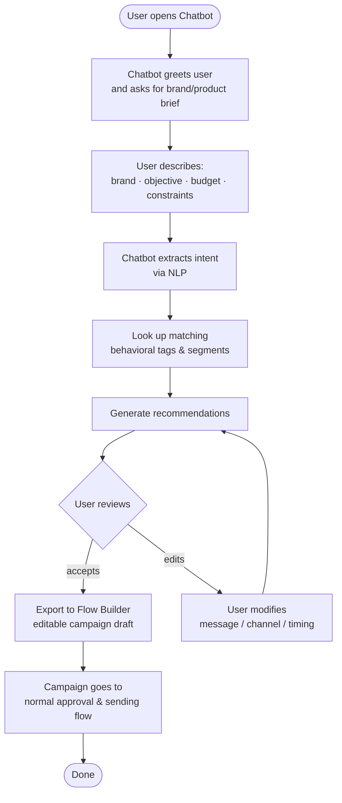
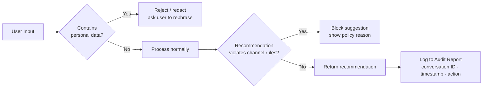
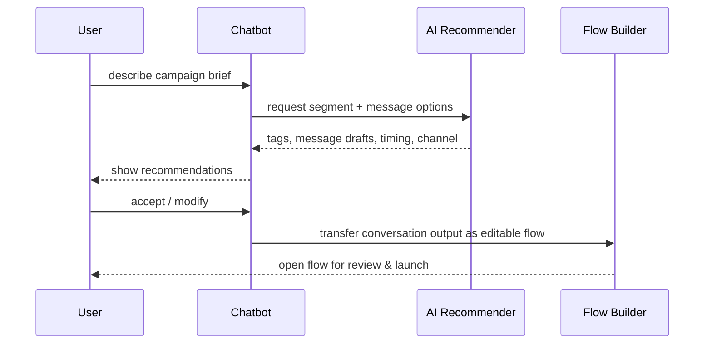

# Jazebeh Guide Chatbot — Campaign-Building Assistant

> Planned for 1405

## Conversation Flow

---

## Recommendation Output per Conversation

| Output | Description |
|--------|-------------|
| Message drafts | Multiple tones (formal / casual / promotional) |
| Channel suggestion | SMS / Messenger A / B, based on segment preference |
| Timing suggestion | Best send time from behavioral data |
| Behavioral tags | Matching audience tags from v1/v2 list |
| Campaign path | If/Else or multi-branch flow, ready to import |

---

## Compliance & Privacy Rules

---

## Integration with Platform

