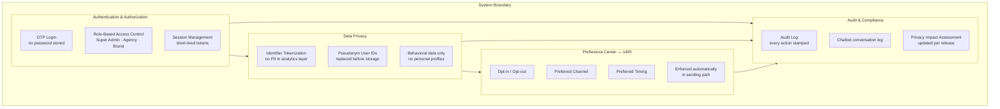
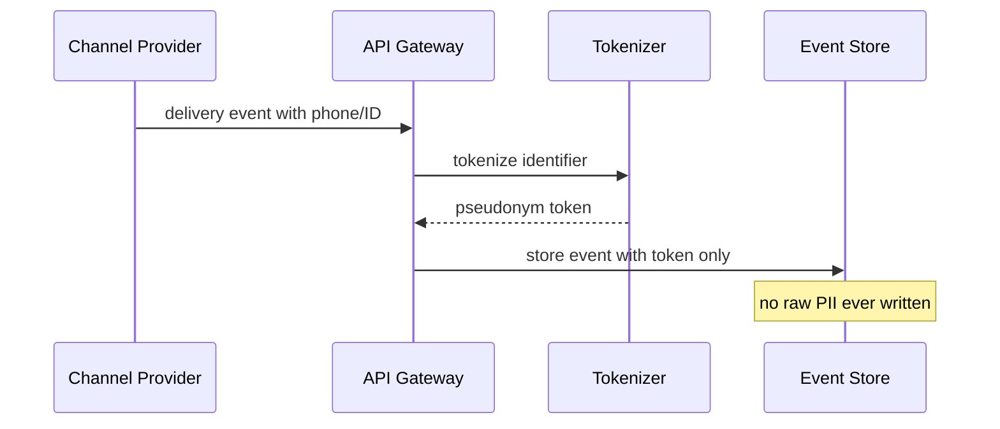

# Security & Privacy Architecture

## Overview

---

## Tokenization Flow

---

## Role-Based Access Control Matrix

| Resource | Super Admin | Agency | Brand User |
|----------|-------------|--------|-----------|
| All customer data | Read/Write | None | None |
| Own brand campaigns | Read/Write | Read/Write | Read/Write |
| Sub-account campaigns | Read/Write | Read | None |
| Pricing & dynamic pricing | Read/Write | Read | None |
| Sending approval | Read/Write | None | None |
| Wallet & billing (own) | Read/Write | Read/Write | Read/Write |
| Audit logs | Read | None | None |
| Behavioral tag store | Read/Write | Read | Read |

---

## Privacy Targets

| Target | Value |
|--------|-------|
| Data leakage incidents in pilots | 0 |
| Audit log completeness | 100% |
| Preference enforcement | automatic, real-time |
| PII in analytics layer | 0 — tokenized identifiers only |
