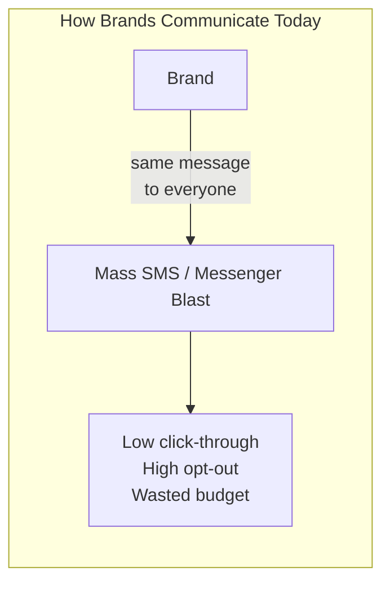
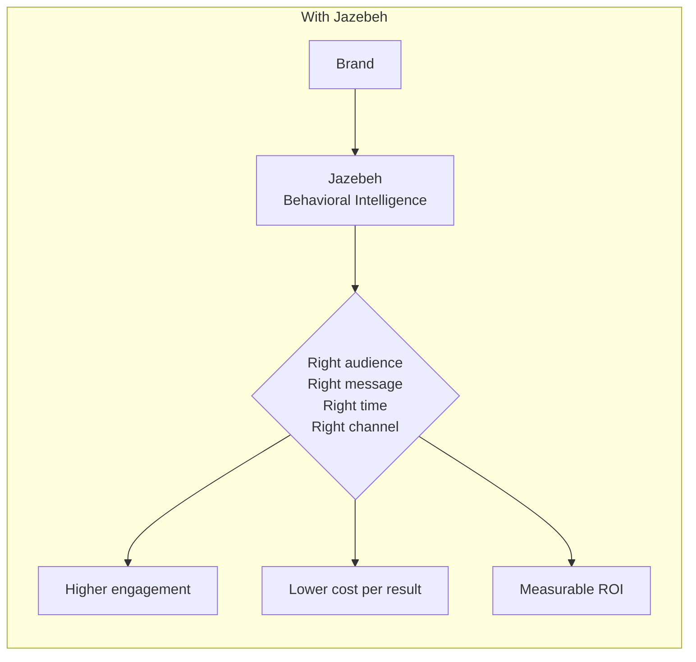
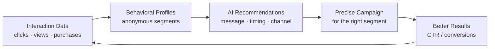
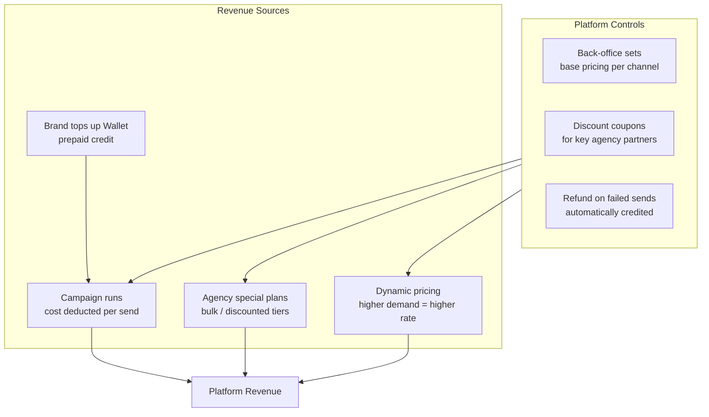

# Value Proposition

## The Problem

---

## Our Answer

---

## How Value is Created

> Every campaign improves the next one. The platform learns continuously.

---

## Who Benefits

| Stakeholder | What They Get |
|-------------|--------------|
| **Brand / Advertiser** | Higher CTR, less wasted spend, ready-made audience segments |
| **Marketing Agency** | Manage multiple brand clients from one panel, performance reporting |
| **End Consumer** | Receives only relevant messages, controls preferences |
| **Platform (Jazebeh)** | Usage-based revenue from campaigns and wallet charges |

---

## How Jazebeh Earns Revenue

| Revenue Lever | Mechanism | Scales With |
|--------------|-----------|------------|
| Wallet top-ups | Brands pre-load credit | Number of active brands |
| Per-send billing | Cost deducted per message delivered | Campaign volume |
| Agency plans | Negotiated bulk pricing | Agency client growth |
| Dynamic pricing | Rate adjusts to demand | Platform traffic & peak loads |
| Refund policy | Failed sends credited back | Platform reliability |
