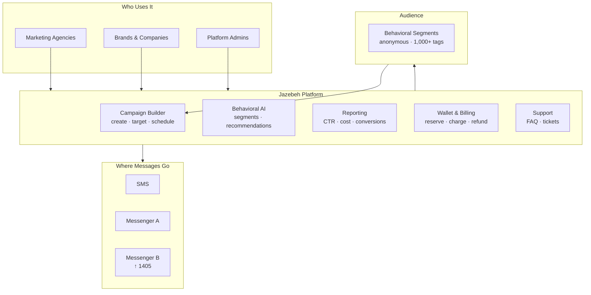
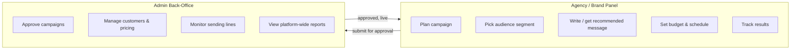
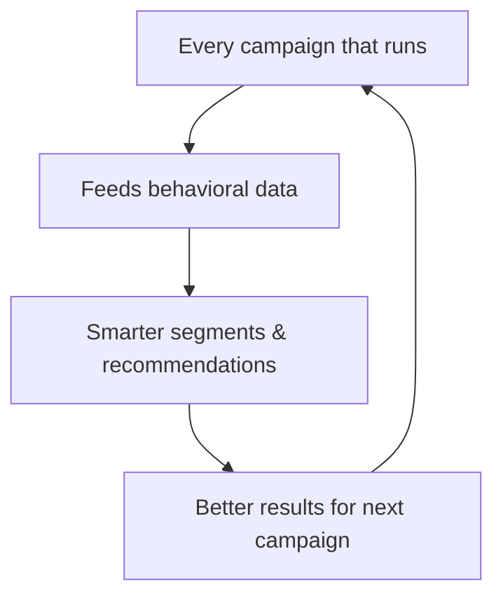

# Platform Overview

## What Jazebeh Does

---

## Two Panels, One Ecosystem

---

## Shared Intelligence Layer

> The more campaigns run on Jazebeh, the more accurate the AI becomes for all users.
