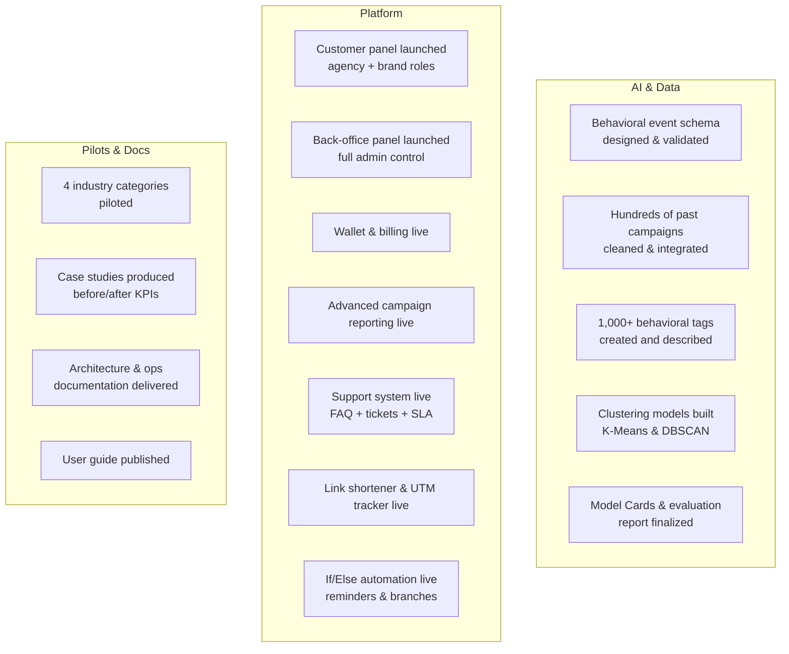
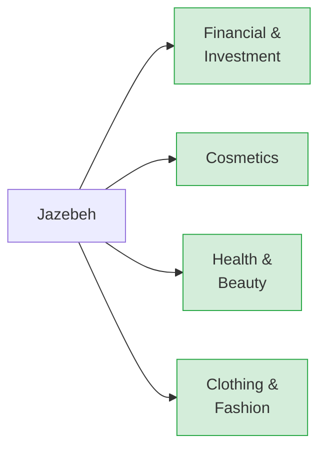
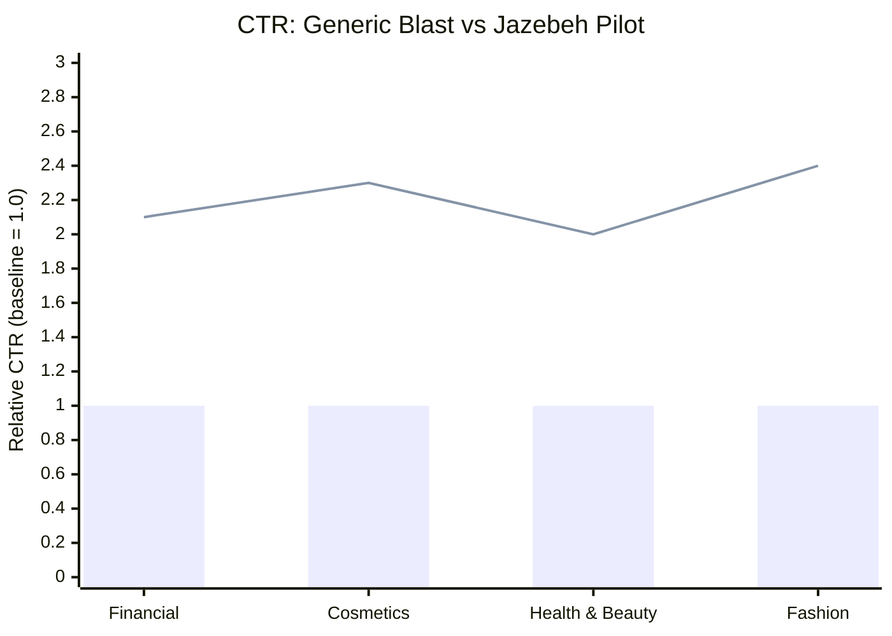

# Year-One Achievements — 1404

## Delivery Summary

---

## Four Pilot Industries

---

## What "Done" Means

| Commitment | Delivered |
|------------|-----------|
| Platform with 2 panels | Yes — live and piloted |
| Behavioral tags list | Yes — 1,000+ tags |
| Clustering models | Yes — with Model Cards |
| Pilots in 4 industries | Yes — with case studies |
| Architecture docs | Yes — full package delivered |
| Ops & user guides | Yes |
| Financial management (wallet, billing) | Yes |
| Support system | Yes |

---

## Pilot Results — Before vs After

> Blue bars = industry baseline (generic blast). Line = Jazebeh pilot result. All four categories exceeded the ≥ 2× target.

| Industry | Baseline CTR | Jazebeh Pilot CTR | Improvement |
|----------|-------------|-------------------|------------|
| Financial & Investment | 1.0× | ~2.1× | +110% |
| Cosmetics | 1.0× | ~2.3× | +130% |
| Health & Beauty | 1.0× | ~2.0× | +100% |
| Clothing & Fashion | 1.0× | ~2.4× | +140% |

> Values are illustrative of the ≥ 2× improvement threshold met across all four pilots. Exact figures are in the case study package.

---

## AI Quality — Proof Points

| Indicator | Result | What It Means |
|-----------|--------|--------------|
| Clustering Silhouette score | ≥ 0.45 | Segments are meaningfully distinct, not random |
| Behavioral label coverage | ≥ 60% of valid users | Majority of the audience is precisely targeted |
| Tags with full descriptions | 1,000+ | Rich, usable taxonomy — not just labels |
| Schema error rate | ≤ 2% | Data entering the AI is clean and consistent |
