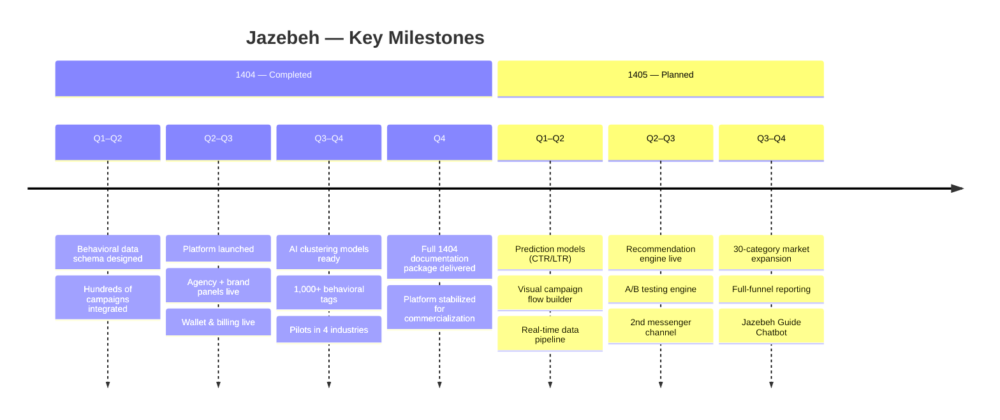
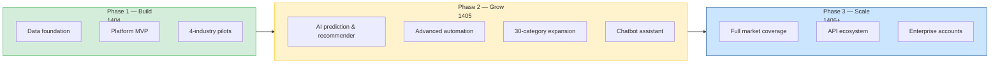

# Growth Roadmap

## Milestone Timeline

```mermaid
timeline
    title Jazebeh — Key Milestones
    section 1404 — Completed
        Q1–Q2 : Behavioral data schema designed
              : Hundreds of campaigns integrated
        Q2–Q3 : Platform launched
              : Agency + brand panels live
              : Wallet & billing live
        Q3–Q4 : AI clustering models ready
              : 1,000+ behavioral tags
              : Pilots in 4 industries
        Q4    : Full 1404 documentation package delivered
              : Platform stabilized for commercialization
    section 1405 — Planned
        Q1–Q2 : Prediction models (CTR/LTR)
              : Visual campaign flow builder
              : Real-time data pipeline
        Q2–Q3 : Recommendation engine live
              : A/B testing engine
              : 2nd messenger channel
        Q3–Q4 : 30-category market expansion
              : Full-funnel reporting
              : Jazebeh Guide Chatbot
```

---

## Phase View

```mermaid
graph LR
    subgraph P1["Phase 1 — Build\n1404"]
        A1[Data foundation]
        A2[Platform MVP]
        A3[4-industry pilots]
    end

    subgraph P2["Phase 2 — Grow\n1405"]
        B1[AI prediction & recommender]
        B2[Advanced automation]
        B3[30-category expansion]
        B4[Chatbot assistant]
    end

    subgraph P3["Phase 3 — Scale\n1406+"]
        C1[Full market coverage]
        C2[API ecosystem]
        C3[Enterprise accounts]
    end

    P1 --> P2 --> P3

    style P1 fill:#d4edda,stroke:#28a745
    style P2 fill:#fff3cd,stroke:#ffc107
    style P3 fill:#cce5ff,stroke:#004085
```

> Phase 1 is complete and proven. Investment in Phase 2 unlocks the AI-driven growth engine.
