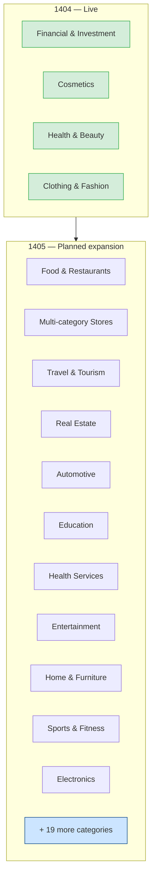
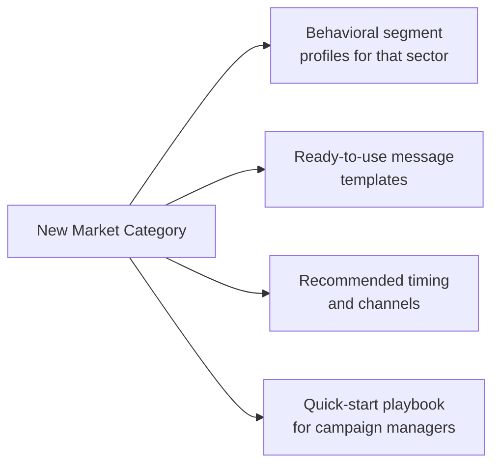
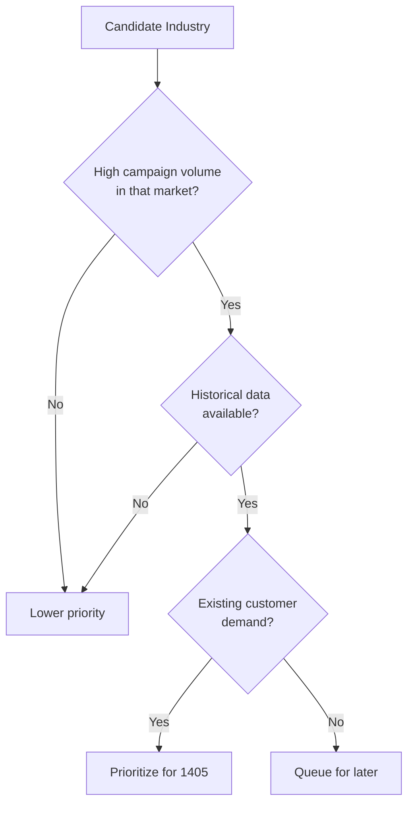

# Market Expansion

## From 4 to 30 Industries

---

## What Each Industry Gets

---

## Expansion Priority Logic

---

## Market Opportunity

| Stage | Categories | Addressable Campaigns |
|-------|-----------|----------------------|
| 1404 Pilots | 4 | Controlled pilots only |
| 1405 Target | 30 | Full commercial rollout |
| 1406+ Vision | 50+ | Enterprise & API channel |
