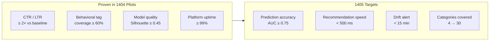
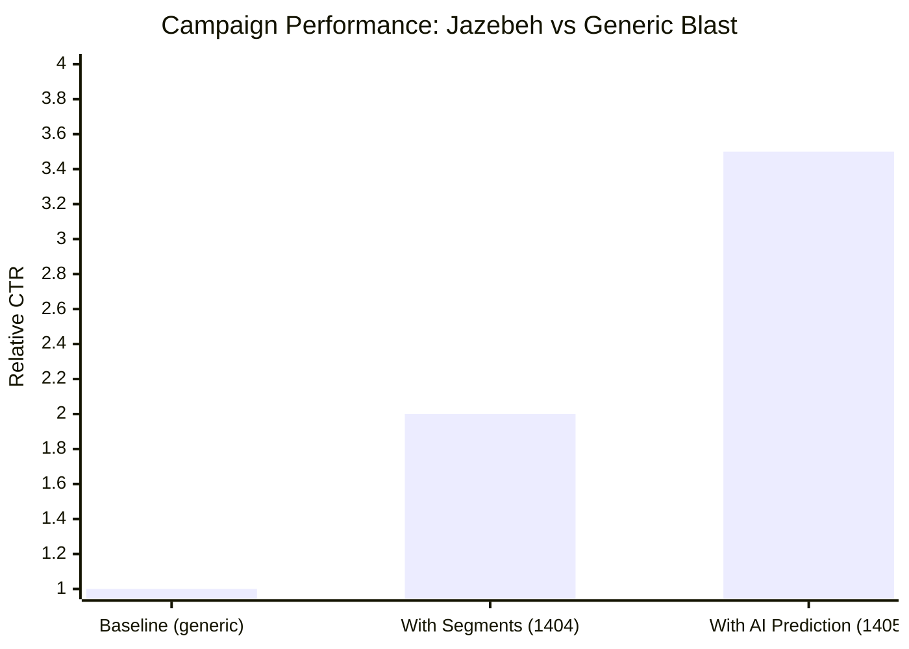
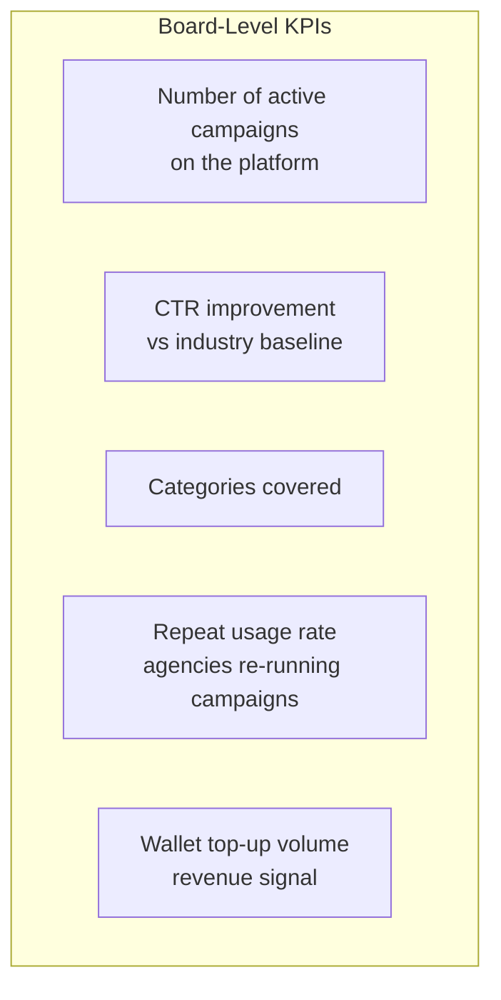

# Key Results & Targets

## The Core Proof Points

---

## Performance at a Glance

| Result | What It Means for the Business |
|--------|-------------------------------|
| **CTR ≥ 2× baseline** | Every campaign on Jazebeh performs at least twice as well as a generic blast |
| **1,000+ behavioral tags** | Rich audience understanding that improves with every campaign |
| **≥ 60% audience labeled** | Majority of active users can be precisely targeted, not guessed |
| **≥ 99% platform uptime** | Enterprise-grade reliability proven in real pilots |
| **AUC ≥ 0.75 (target)** | AI correctly predicts who will click/convert before money is spent |

---

## Efficiency Improvement Over Time

---

## What Investors Should Watch

