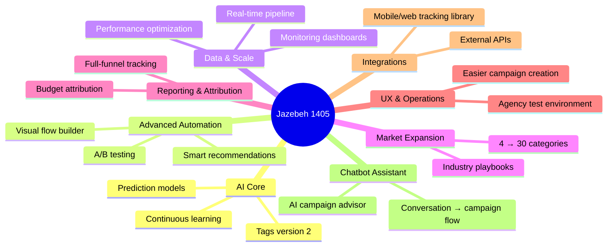
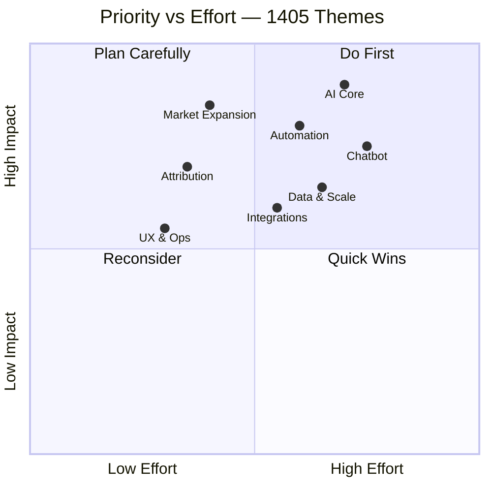
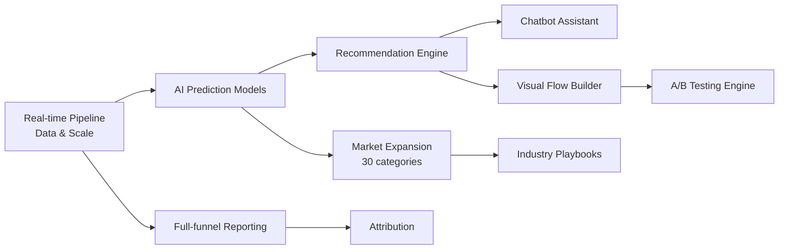
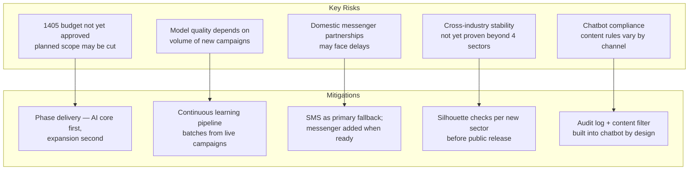

# 1405 Investment Themes

## Eight Strategic Bets

---

## Theme-by-Theme Impact

| Theme | What Changes for Customers | Revenue Signal |
|-------|---------------------------|----------------|
| **AI Core** | Recommendations get precise; less guesswork | More campaigns run, higher confidence to spend |
| **Automation** | Brands build complex journeys in minutes, not days | Larger campaigns, higher wallet usage |
| **Data & Scale** | Platform handles peak loads reliably | Retains large agency clients |
| **Market Expansion** | 30 industries can now onboard immediately | 7.5× growth in addressable customers |
| **Attribution** | Brands see exact ROI per channel | Budget shifts to Jazebeh from other channels |
| **UX** | Agencies onboard without training calls | Lower sales cost, faster activation |
| **Integrations** | Brands sync their own data | Stickiness — harder to switch platforms |
| **Chatbot** | Any brand can launch a campaign in minutes | Lowers the barrier for SMBs |

---

## Priority vs Effort

---

## Dependency Flow — What Unlocks What

---

## Risks & Mitigations

| Risk | Likelihood | Impact | Mitigation |
|------|-----------|--------|-----------|
| Budget approval delayed | Medium | High | Prioritize AI core + market expansion — highest ROI themes |
| Insufficient new campaign data | Low | Medium | Live campaigns from 1404 users feed the pipeline immediately |
| Messenger partner delay | Medium | Low | SMS fully live; 2nd messenger is additive, not blocking |
| Model drift in new industries | Low | Medium | Per-industry Silhouette gating before launch |
| Chatbot content violations | Low | High | Content filter + audit log enforced by architecture |
